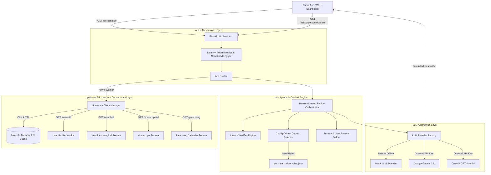

# AstroEngine AI: Personalization & GenAI Context Orchestrator

[](https://www.python.org/)
[](https://fastapi.tiangolo.com/)
[](https://docs.pydantic.dev/)
[](https://www.docker.com/)
[](https://opensource.org/licenses/MIT)

**AstroEngine AI** is an enterprise-grade, high-performance **GenAI Context Orchestration & Personalization Layer** that bridges structured domain microservices (User Profile, Kundli, Horoscope, Panchang) and Large Language Models (Google Gemini, OpenAI GPT-4o, or offline Mock LLM providers).

Rather than naively dumping raw API payloads into LLM context windows, **AstroEngine AI** performs intent detection, dynamic context pruning, token budgeting, and persona adaptation to generate grounded, context-aware AI completions.

---

## 🏛️ Architecture & Orchestration Pipeline



---

## ✨ Core Features & GenAI Capabilities

1. **High Concurrency Microservice Aggregation**:
   - Queries upstream microservices concurrently using Python `asyncio.gather(return_exceptions=True)`.
   - Built-in per-service timeouts (default 2s), exponential backoff retries, and graceful degraded fallbacks.

2. **In-Memory Async TTL Cache**:
   - Thread-safe `AsyncTTLCache` prevents redundant API calls for active user sessions.

3. **Dynamic Context Pruning & Exclusions**:
   - Driven by `app/rules/personalization_rules.json`.
   - Filters out irrelevant topics before building prompts (e.g., stripping `Relationship Horoscope` for `Career` questions) to save tokens and prevent context contamination.

4. **Intent Classification**:
   - Multi-pattern regex scoring and keyword analyzer classifying questions into `career`, `relationship`, `health`, `finance`, or `general` query domains.

5. **Multi-Provider LLM Abstraction**:
   - Pluggable `BaseLLMProvider` interface with support for:
     - **Mock Provider**: Realistic, offline context-grounded generator.
     - **Google Gemini**: Uses official `google-genai` SDK (`gemini-2.5-flash`).
     - **OpenAI**: Uses `openai` SDK (`gpt-4o-mini`).

6. **Observability & Prompt Token Metrics**:
   - Tracks character count, estimated token usage (~4 chars/token), system vs user prompt sizes, and execution latency per request.

7. **Interactive Web Studio**:
   - Embedded single-page dashboard at `http://localhost:8000/` for visual context debugging and live testing.

---

## ⚡ Quickstart Guide

### Option 1: Local Virtual Environment
```bash
# Clone the repository
git clone https://github.com/YOUR_USERNAME/AstroEngine-AI.git
cd AstroEngine-AI

# Execute setup and automated test runner
chmod +x run.sh
./run.sh
```

### Option 2: Docker & Docker Compose
```bash
# Build and launch with Docker Compose
docker-compose up --build
```

Access services:
- **Interactive Web Studio**: [http://localhost:8000/](http://localhost:8000/)
- **OpenAPI Swagger Docs**: [http://localhost:8000/docs](http://localhost:8000/docs)

---

## 📡 API Contract & Usage Examples

### 1. `POST /personalize`
Executes the full context aggregation, filtering, prompt building, and LLM completion pipeline.

```bash
curl -X POST "http://localhost:8000/personalize" \
     -H "Content-Type: application/json" \
     -d '{
       "userId": "user_101",
       "question": "Should I consider changing my job in the next few months?"
     }'
```

**Response**:
```json
{
  "answer": "Hello Aarav Sharma! Regarding your career transition: Your astrological alignment looks very favorable. Your 10th house lord Moon (Strength: Strong) indicates high professional potential and strong recognition. Under your current Rahu-Mars Dasha, key movements and decision points are active. Guidance for career: 'Networking may bring new opportunities.' Today's Panchang (Shukla Panchami, Rohini Nakshatra) supports clear decision-making. Trust your intuition and take calculated steps towards your goal!",
  "confidence": "HIGH",
  "sourcesUsed": [
    "Career Horoscope",
    "10th House",
    "Current Dasha",
    "Current Panchang"
  ]
}
```

---

### 2. `POST /debug/personalization`
Executes Intent Classification and Context Filtering **WITHOUT calling the LLM**. Ideal for context auditing.

```bash
curl -X POST "http://localhost:8000/debug/personalization" \
     -H "Content-Type: application/json" \
     -d '{
       "userId": "user_101",
       "question": "Should I consider changing my job in the next few months?"
     }'
```

**Response**:
```json
{
  "intent": "career",
  "selectedContext": [
    "Career Horoscope",
    "10th House",
    "Current Dasha",
    "Current Panchang"
  ],
  "excludedContext": [
    "Relationship Horoscope",
    "Finance Horoscope"
  ],
  "language": "English",
  "tone": "Motivational",
  "maxWords": 300,
  "promptMetrics": {
    "character_count": 1366,
    "estimated_token_count": 342,
    "system_prompt_snippet": "You are MyNaksh's expert AI Vedic Astrologer...",
    "user_prompt_snippet": "USER QUESTION: \"Should I consider changing my job...\""
  },
  "upstreamStatus": {
    "user": "CACHE_HIT",
    "kundli": "CACHE_HIT",
    "horoscope": "CACHE_HIT",
    "panchang": "CACHE_HIT"
  }
}
```

---

## 🎯 Context Mapping Rules (`personalization_rules.json`)

| Intent | Primary Context | Secondary Context | Exclude |
| :--- | :--- | :--- | :--- |
| **Career** | 10th House, Career Horoscope | Current Dasha, Panchang | Relationship Horoscope, Finance Horoscope |
| **Relationship** | 7th House, Relationship Horoscope | Moon Sign, Current Dasha | Career Horoscope, Finance Horoscope |
| **Health** | 6th House, Health Horoscope | Moon Sign, Panchang | Finance Horoscope, Career Horoscope |
| **Finance** | Finance Horoscope, Current Dasha | 6th House, Panchang | Relationship Horoscope |
| **General** | All Available Context | — | — |

---

## 🧪 Testing Suite

Execute unit and integration test suite:
```bash
./venv/bin/pytest -v
```

Test coverage:
- `test_intent.py`: Regex & keyword intent classification accuracy.
- `test_upstream.py`: Upstream concurrency with `asyncio.gather` & TTL cache hit tracking.
- `test_engine.py`: Context selection rules and source exclusion validation.
- `test_api.py`: Endpoint schema validation for `/personalize` and `/debug/personalization`.
- `test_cache.py`: Async TTL cache eviction and metrics.

---

## 📄 License

This project is licensed under the [MIT License](LICENSE).
